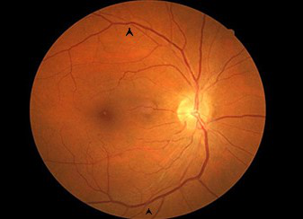
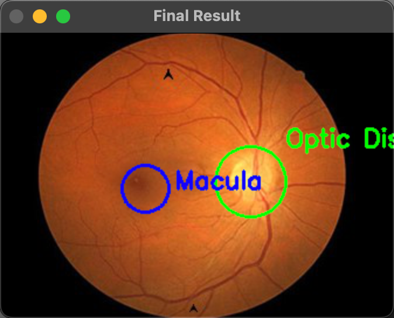

# Retinal Landmark Detector

An automated computer vision system for analyzing fundus images, specifically designed to detect and analyze key anatomical landmarks in retinal images, including the optic disc and macula.

## Features

- Automatic detection of optic disc location and size
- Macula localization based on optic disc position
- Vessel structure detection and analysis
- Automatic valid region detection, excluding image edges and background
- Interactive visualization of analysis results

## System Requirements

- Python 3.6+
- OpenCV
- NumPy
- Matplotlib

## Installation

1. Clone the repository:
```bash
git clone https://github.com/Michael-jze/Retinal-Landmark-Detector
cd Retinal-Landmark-Detector
```

2. Install dependencies:
```bash
pip install -r requirements.txt
```

## Usage

1. Prepare your fundus image (supports common image formats like jpg, png)

2. Run the main program:
```bash
python main.py [image_path]
```

3. Result demo:
   - input:

      
   - output:
   
      

4. The program will automatically:
   - Load and preprocess the image
   - Detect optic disc location and size
   - Identify vessel structures
   - Locate the macula region
   - Display analysis results

## Output

The program displays several visualization windows during processing:
- Original image
- Vessel detection results
- Optic disc detection results
- Macula candidate regions
- Final analysis results

## Implementation Details

The system employs a multi-step image processing and analysis approach:

1. Image Preprocessing
   - Loading raw fundus images
   - Computing valid region mask to exclude edges and background
   - Image enhancement and normalization

2. Optic Disc Detection
   - Color segmentation in HSV color space
   - Morphological operations for result optimization
   - Calculation of optic disc center and radius

3. Vessel Detection
   - Contrast enhancement using CLAHE algorithm
   - Vessel structure detection using Laplacian operator
   - Morphological operations to optimize vessel network

4. Macula Localization
   - Search region determination based on optic disc position
   - Vessel density distribution analysis
   - Gray value analysis for macula position
   - Multi-feature fusion for optimized localization

5. Result Visualization
   - Real-time processing display
   - Key anatomical structure marking
   - Interactive viewing capabilities

## Limitations

1. Disease Impact
   - The system is optimized for normal fundus images
   - Detection accuracy may be reduced for images with retinal diseases (e.g., diabetic retinopathy, macular degeneration)
   - Professional medical judgment should be combined in clinical applications

2. Image Quality Requirements
   - Clear fundus images are required
   - Moderate image contrast is necessary
   - Severe image noise and artifacts should be avoided

3. Special Cases
   - System parameters may need adjustment for unusual retinal variations
   - Thorough testing and validation are recommended before clinical use

## Contributing

Contributions are welcome! Please feel free to submit a Pull Request.


## License

This project is licensed under the MIT License - see the [LICENSE](LICENSE) file for details.

## Contact

For any questions or suggestions, please contact:
- Email: jzengag@gmail.com 

